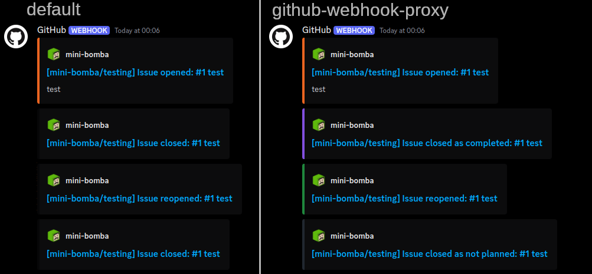
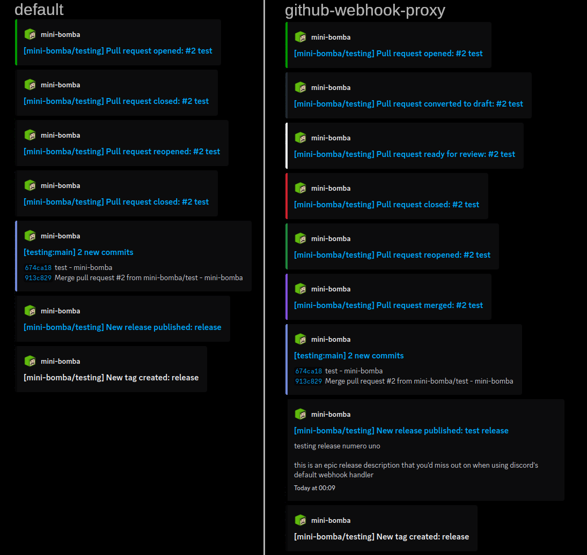

# github-webhook-proxy

> [!WARNING]
> This repo is deprecated in favour of [github-webhook-enhancer-deno](https://github.com/mini-bomba/github-webhook-enhancer-deno).
> Recently I've started having issues with discord blocking cloudflare workers IPs, which often resulted in dropped events.
> Due to this, I've decided to reorganize this project in a way that allows it to be selfhosted with deno, which hopefully will resolve this issue.

A WebWorker that proxies webhook payloads between GitHub and Discord,
adding extra data for some events.

Public instance available at https://github-webhook-proxy.minibomba.workers.dev

## Routes
```
POST /{channel ID}/{webhook token} - Execute webhook
POST /{channel ID}/{webhook token}?color={color}
channel ID and webhook token should be taken from a discord webhook URL
color specifies embed color for the release created event

/ - Redirects to this repository
/version - Sends currently deployed git hash
/source - Redirects to a view of the currently deployed commit
```

## How to use
Grab a discord webhook URL and replace `https://discord.com/api/webhooks` with `https://github-webhook-proxy.minibomba.workers.dev` (or your own instance URL)

## Why
Discord's GitHub webhook support isn't great. It doesn't attach release descriptions to messages about them being created, it can't differentiate between a PR getting closed and it getting merged, it doesn't know about the different issue close reasons.
This project was created to mitiage some of these issues.

It currently intercepts and improves the following events:
- release creation
  - adds the release description and timestamp into the message
- issue closing/reopening
  - includes the reason for closing the issue (completed/not planned)
  - adds colors associated with the different close reasons and reopening the issue
- pull requests
  - differentiates between closing and merging the PR
  - sends messages when a PR is marked as draft or ready for review
  - adds colors associated with these actions
  - blocks "Pull request review submitted" events when someone comments on a review
    - review comment content will still be sent to discord if pull_request_review_comment event is enabled. this simply removes the noise

## some images i guess
### issue events

### PR and release events

